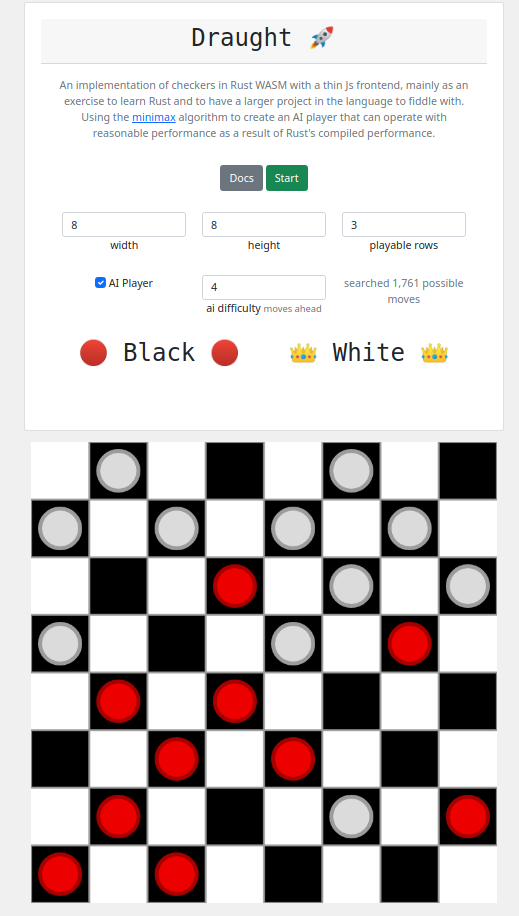

Rust is a great language for low-level work. Its memory model and syntactic sugar make it attractive for new projects, eliminating many types of bugs by design.

Likewise, WebAssembly is an attractive prospect for speeding up client-side web code. Combining the compiled performance, type safety and memory safety of Rust with the mature GUI development ecosystem of HTML/Javascript/CSS extends the possibilities for what can be completed client-side.

It's these ideas that made me want to explore Rust + WASM - prior to this, I knew little about either beyond the basic tutorials. In my masters AI module, I studied adversarial game models including the [MiniMax algorithm](https://en.wikipedia.org/wiki/Minimax). This algorithm generates a tree of possible moves and compares scores to decide which move should be made. Generating this tree can be expensive as it explodes exponentially, as such it would be a good candidate to try and speed up using compiled Rust over interpreted Javascript.

###### Standard checkers board rendered on an HTML canvas using Rust

The project took about 3 weeks off and on. Initially, I wanted to model the game board without the off-diagonal pieces that aren't played on. This would have helped reduce the memory footprint of each board which would be ideal when we are going to be handling a lot. Unfortunately, this significantly increased the complexity of modelling piece movements - after some trial and error I resorted to just modelling the whole board.

The MiniMax algorithm was also a bit of a pain. The algorithm relies on a tree structure for which I used the [IndexTree crate](https://crates.io/crates/indextree). Instead of using pointers between nodes that could rely on unsafe code, this library instead relies on a single backing array of nodes. Working out how to effectively create, populate and traverse the trees while following the borrow checker's rules was an effective learning exercise.

###### Javascript UI with a Rust-controlled canvas

The performance of the game and the AI was pretty impressive. This was also without any Alpha-Beta pruning, a method to reduce the number of tree nodes that need searching. Below are the results of a basic benchmark for expanding the MiniMax tree to given depths both in development mode and release mode.

| Tree Depth | Dev Mode (Unoptimised) | Release Mode (Optimised) |
|------------|------------------------|--------------------------|
| 1          | 0.86 ms                | 0.1 ms                   |
| 2          | 4 ms                   | 0.26 ms                  |
| 3          | 30 ms                  | 2 ms                     |
| 4          | 223 ms                 | 15 ms                    |
| 5          | 1,798 ms               | 116 ms                   |
| 6          | 14,379 ms              | 1,006 ms                 |
| 7          | 120,534 ms             | 9,028 ms                 |

###### Time to generate a move with trees of various depths (Chromium/Linux)

At first, the AI was intimidatingly good. In fairness I am far from a checkers expert, I don't know how to play particularly "tactically" or anything like that. Something that I found interesting was that increasing the search depth did not necessarily make the AI feel harder to play. Setting the depth to 1 or 2 made the other player very aggressive, taking any piece it could. When increasing the search depth, the player wouldn't necessarily just take any piece when able to, but it was good at blocking moves the human may try to make. 

In order to make the game more fun to play, I introduced a further parameter, the _perfect chance_. Instead of always following the move that the MiniMax algorithm suggested, instead it would sometimes pick a random move instead. This was decided randomly turn-by-turn using a threshold between 0 and 1. This threshold was presented as a difficulty slider within the UI and made the game much more fun to play.

Ultimately, I was pretty happy with the project and it can now be used as a testbed for trying out new Rust, WASM and Javascript skills that I learn. 

[GitHub Repo](https://github.com/sarsoo/draught)

[Try it out!](https://draught.sarsoo.xyz/)