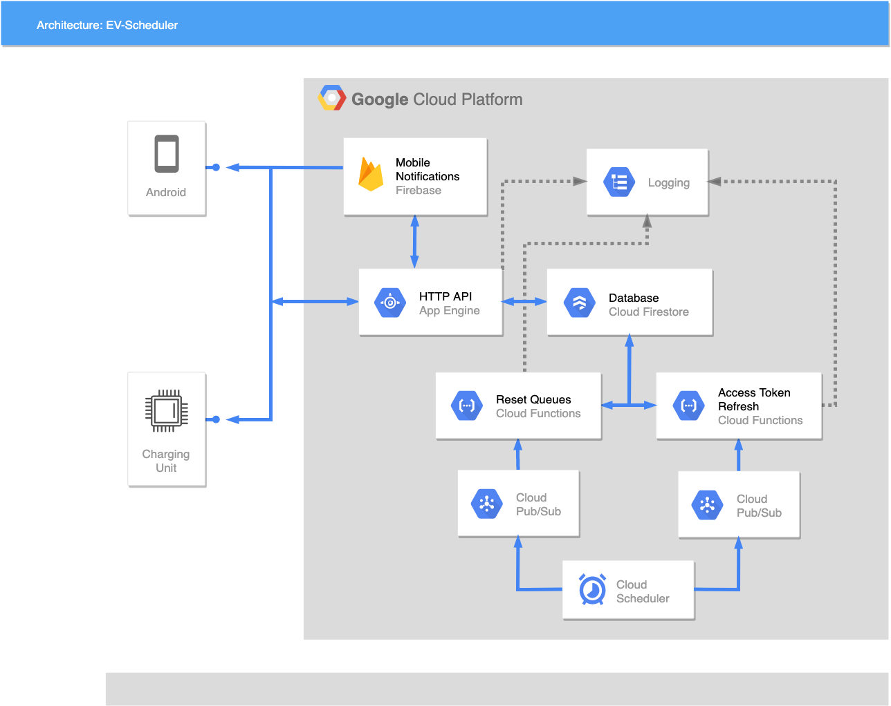
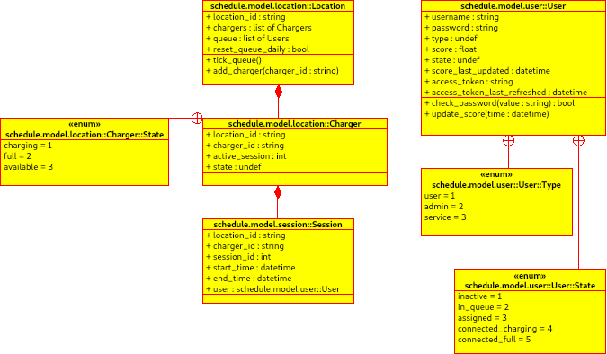

As part of my third-year group project, I wrote and deployed a cloud-based electric vehicle scheduling system. The target use case was for public or internally accessible electric vehicle charging spots. Leaving a car in the spot past when it has charged stops other people for using it, the idea was to allow people to book slots for spaces instead.

The project was divided into three areas of concern: 

- An IoT-esque device which mounts on the charging point and intelligently reports the status of the charging station to the cloud service
- A mobile app for requesting slots and receiving notifications
- A cloud-based back end service for hosting the application's logic

[Github Repo](https://github.com/Sarsoo/electric-vehicle-scheduler)

I was responsible for designing, writing and deploying the cloud service, my report on this aspect can be seen below,

[Read the report here.](group-cloud-report.pdf)

