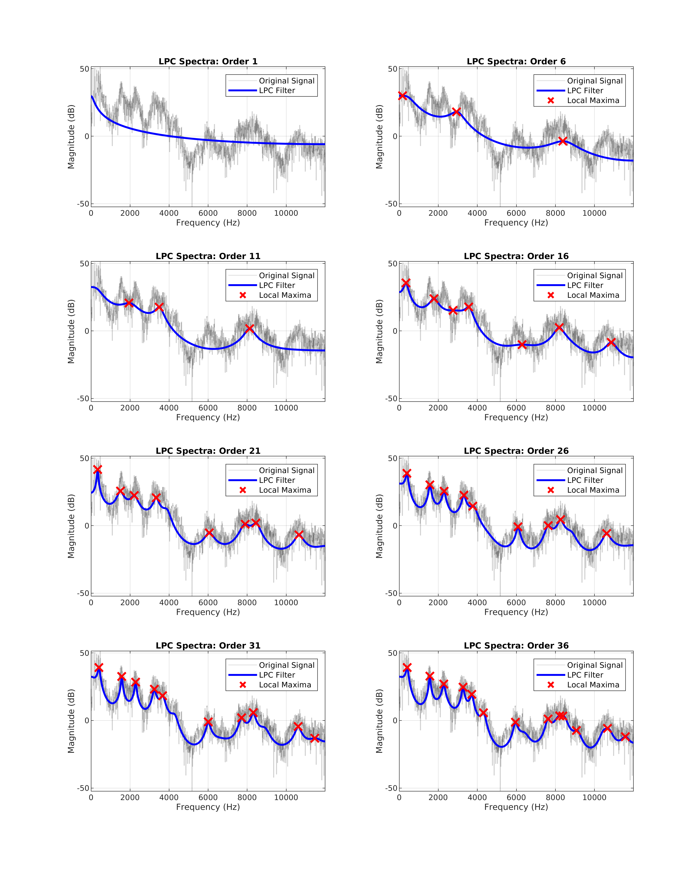

During my speech & audio processing & recognition post-grad module, I completed two pieces of coursework. The first of which involved writing and analysing a speech synthesiser utilising linear predictive coding. The report achieved 95%.



The report analysed two vowel segments in order to identify their fundamental frequencies and the first handful of formant frequencies. After this, linear predictive coefficients of varying orders were calculated and used in conjunction with the fundamental frequency to re-synthesise the vowel.

[Read the report here.](final-report.pdf)

