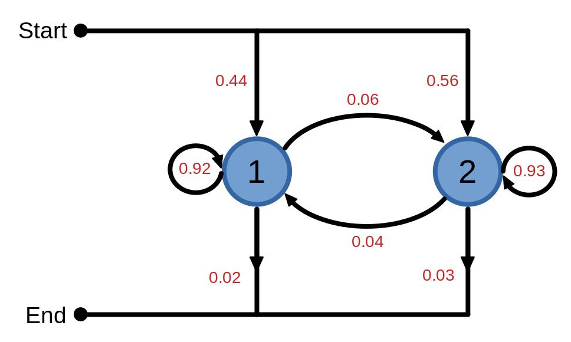
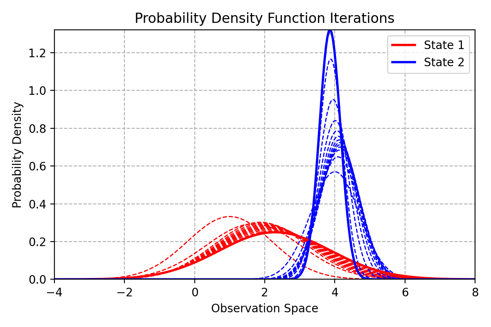
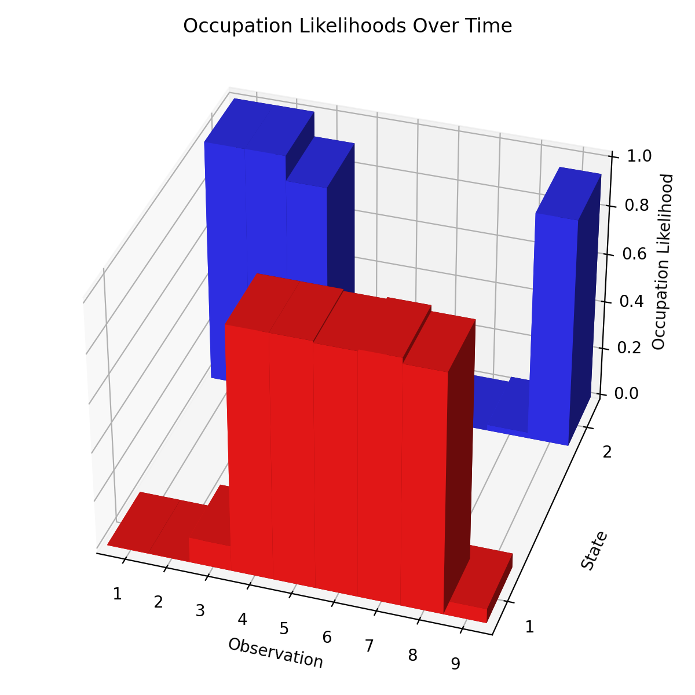

###### Markov model state topology

The second piece of coursework for my speech & audio processing & recognition module was focused on the machine learning side of the field. One of the main methods we learnt about were __Hidden Markov Models__ and how to train them, this coursework was a test of the theory. My submission achieved 98%.

###### Re-estimated probability density function outputs after training

The provided spec for the model included the __entry, exit__ and __transition__ probabilities, the parameters for each state's __Gaussian output__ function and the observations used for training.

From here, the coursework tested the ability to calculate and analyse various aspects of the model including __forward, backward, occupation__ and __transition__ likelihoods. A single iteration of __Baum-Welch__-based training was completed resulting in a new set of __transition__ probabilities and __output function parameters__.

###### Probability of being in each state at each time step or observation

The above graph is presenting the __occupation likelihoods__ of each state at each time step or observation. It is the joint probability from the forward and backward likelihoods. From here it looks like the observations were taken from state 2 for 3 time-steps before swapping to state 1 for 4 time-steps and changing back to state 2 for the last one.

[GitHub Repo](https://github.com/Sarsoo/markov-models)

[Read the report here.](report.pdf)