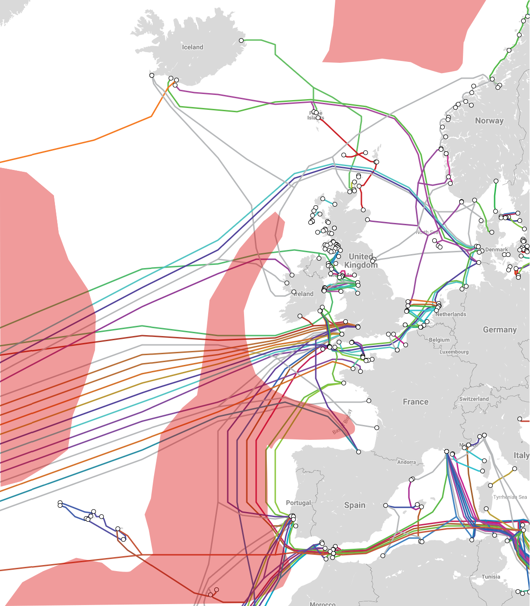

I've just completed one of my post-grad modules which was structured as a multi-disciplinary group design project. A group of engineers of varying disciplines came together to design a subsea fibre-optic cable repair ship which is net-zero carbon.

As the electronic engineer, my responsibilities included the designs for the onboard batteries and the underwater drone vehicle.

# Battery

Ammonia fuel cells were selected for powering the vessel. This was a fantastic option as, not only does it not produce carbon during use, but if generated correctly, this element can be net-zero as well. However, from a current-voltage perspective, there is a most efficient state for the cell to be used in and a dynamic load can make the cells less efficient overall.

###### Power usage and the battery capacity modelled over time during a 12 day mission

In order to allow the fuel cells to operate in their most efficient state, a battery is included in between the cells and the drive stage in order to handle these peaks. Lithium-ion batteries were selected and analysed from a sustainability perspective.

The project had a heavy focus on sustainability, the batteries can be somewhat lacking in this regard as a rapidly changing domain. Recycling Lithium-ion batteries isn't done anywhere near as much as it should and key materials are predominantly found in areas with poor environmental and working conditions.

Specifically for our project scope, the carbon cost of components was considered in order to work out whether the project could achieve its goal of net-zero carbon. The carbon cost describes the equivalent weight of carbon dioxide that is produced in order to create the object. Depending on the definition this can include the cost of just creating the subject while more in-depth analyses consider the whole life of a system. This includes proper end-of-life procedures that allow some carbon cost to be deducted like second-use.

# Underwater Drone

Drones are used in subsea cable repair to locate, cut and retrieve each half of the broken cable. A team of specialist conducts the splicing before the ROV returns the cable to the seabed and buries it with its water jet. A design was drawn up to extend the current capabilities of remote underwater vehicles (ROV) to include autonomous operations. This would allow the vehicle to locate the cable on its own.

###### Operating range of the ROV

This requires a number of advances including onboard power, a more advanced navigation system and a more flexible launch and recovery system.

[Read the report here.](report-extra.pdf)