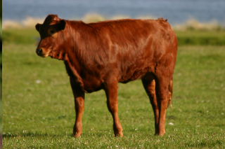
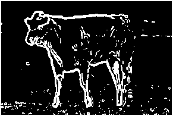
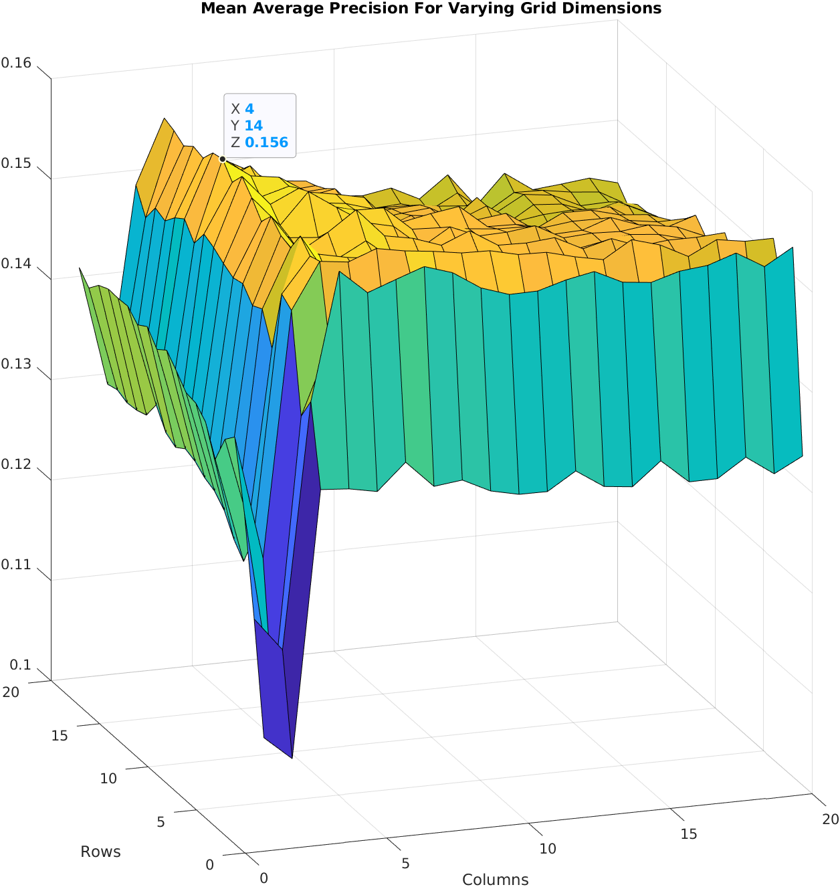
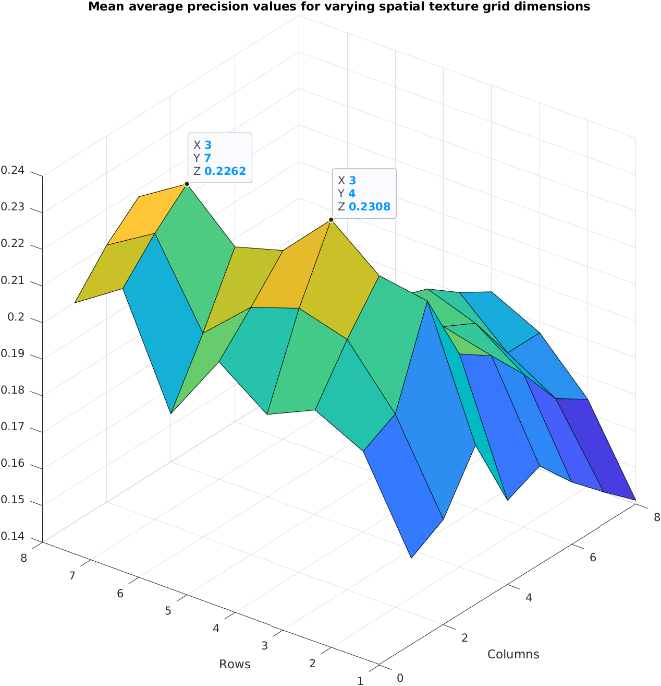
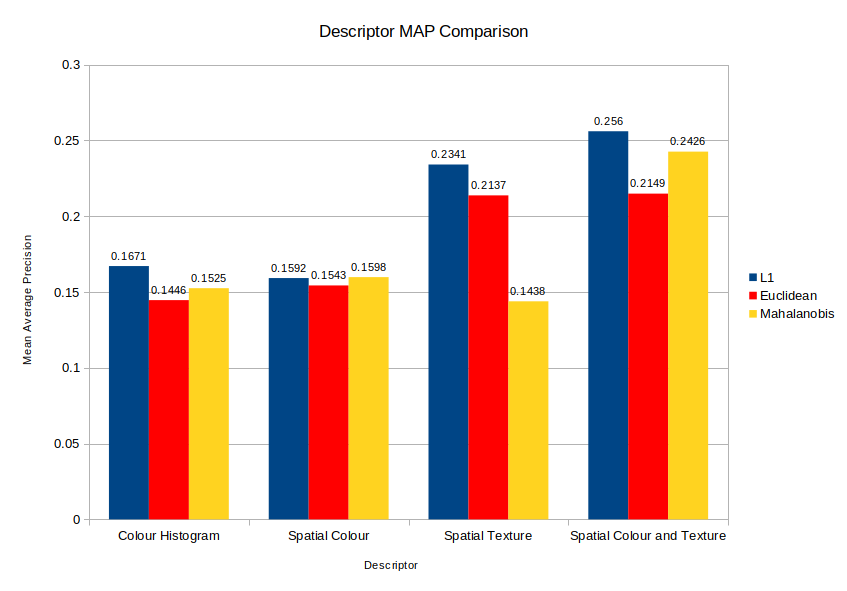
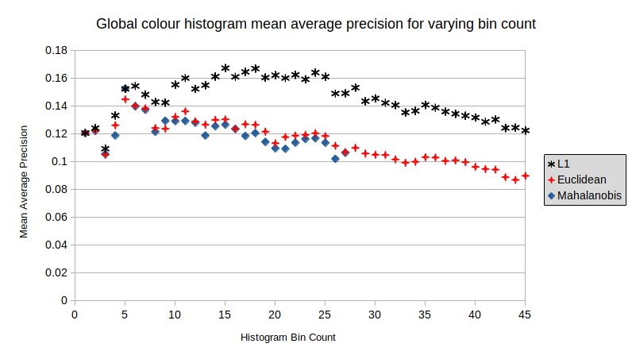

As part of my computer vision and pattern recognition module, I wrote and reported on a [visual search](https://en.wikipedia.org/wiki/Visual_search) system using the [MSRC v2 data set](http://download.microsoft.com/download/3/3/9/339D8A24-47D7-412F-A1E8-1A415BC48A15/msrc_objcategimagedatabase_v2.zip). Visual search is essentially what Google's reverse image search does. Given a target image, the system should be able to return similar images based on its content. The dataset is divided into 20 different categories including trees, cows and faces - a good visual search system will be able to retrieve the images of the same category as the subject before the other less relevant images.

This work achieved full marks.

###### One of the subject images. The image on the right shows the edges detected in the image using the Sobel filter kernel

The system is split into two parts, extraction of [descriptors](https://en.wikipedia.org/wiki/Visual_descriptor) for each of the images and then comparison between these descriptors. A descriptor can be thought of as a fingerprint - a string or vector of numbers that describe aspects of the image. Treating these as vectors allows distances to be calculated between descriptors with closer images being more similar as determined by the descriptor theory. The final answer for a target image is the ranked list of the remaining descriptors, sorted by increasing distance (as the images get less similar to the target). The visual search system was written in MATLAB, it was my first major piece of work in the language.

[Read the report here.](visual-search-coursework.pdf)

The aim of the coursework was to implement and compare different methods for calculating descriptors from less to more complex procedures. Four different descriptors were compared:

# 1. Global Colour Histogram

This method uses the distribution of colours present in the image as a descriptor. It works by considering each pixel of the image as a point in 3D space where each axes is the intensity of each of the red, green and blue channels of the picture. From here, the axes are divided into a 3D grid of blocks. All of the pixels can now be described by the block within which they are found. By taking the histogram of the number of pixels in each square block or _bin_, the distribution of colour in the picture can be summarised. 

# 2. Spatial Colour

One of the downsides of the global colour histogram is that it doesn't consider where the colours are found in the image - you could shuffle the pixels in the image and you would still get the same histogram output. You can see how this could make it harder to compare images, it's not just the colour of an image that is important but how the colour is arranged - where the colours are.

Spatial colour descriptors extend this by first dividing the image into a grid. The idea is to calculate descriptors for each square of the grid and then stick them all together for a _super-descriptor_ of the whole image - when comparing descriptors we are now considering aspects from the same parts of images.

###### Performance of the spatial colour descriptor with varying grid dimensions

Any descriptor method, within reason, can be used as this _sub-descriptor_, but there are a few things to think about here. As you increase the size of a descriptor - compute more and more numbers about an image, you increase the dimensionality of the vector. This becomes an issue as the volume of the space you are considering has grown, increasing complexity. This is called the [_curse of dimensionality_](https://en.wikipedia.org/wiki/Curse_of_dimensionality).

For this report, we just used the average RGB value. This was a good choice as it is only a 3D descriptor. The dimensionality of the final descriptor is going to be 

n x W x H

Where W and H are the width and height of the grid respectively and _n_ is the dimensionality of the sub-descriptor. Instead of having a super complicated sub-descriptor, it may instead be better to use a simpler descriptor like average RGB with a much denser grid.

# 3. Spatial Texture

Spatial texture uses the previously described method of dividing the image up into a grid but uses a different sub-descriptor. This time, the shapes in the image are used instead of the colour information. This can be done by detecting the edges in the image, we did this using a [Sobel filter](https://en.wikipedia.org/wiki/Sobel_operator). The Sobel filter has two orientations for going up or across the image, in fact, it can be described as taking the partial derivative of the image in either axis. The sub-descriptor is then calculated by finding the orientation of edges for each pixel using trigonometry on these partial derivatives.

###### Performance of the spatial texture descriptor with varying grid dimensions

# 4. Spatial Colour & Texture

The final descriptor used was spatial colour and texture. This method combines both the colour and texture information of each grid cell. Theoretically, this should be the best performing descriptor, combining both shape and colour information across varying parts of the image.

# Principal Component Analysis

PCA was also applied to see how this affected the performance of the system. PCA is a common tactic in machine learning for reducing the dimensionality of data by focusing on only the important regions. It is done by calculating the covariance of the dataset which can be decomposed into the eigenvectors and eigenvalues. The size of the eigenvalue is an indication of the amount of variance in that dimension. All of this can be used to project the data to a lower dimensionality for easier processing. [Mahalanobis distance](https://en.wikipedia.org/wiki/Mahalanobis_distance) uses this information and calculates the distance between a point and a distribution relative to the variation in each dimension of the model.

# Results

The below gives a good high-level idea on the performance of each descriptor.

###### Comparisons of different distance measures used in the system for each different descriptor

As might be expected, the less complex colour histogram and spatial colour (using average RGB sub-descriptors) methods weren't as effective as including shape information from the detected edges in the image.

###### Performance differences for each distance measure for global colour histogram descriptor for varying bin counts.

From both of the above graphs, the L1 distance measure consistently outperformed the other measures. This was really surprising to me as it is the most rudimentary and least complex. I had expected that the order would instead be Mahalanobis, Euclidean with L1 last.

This work was one of my favourite pieces of coursework I did at uni. I really got sucked into playing with the different descriptors and visualisation. Once I was happy with the MATLAB syntax I kept adding to the system, finally writing an automation that allowed the surface plots seen above for the different grid sizes. These were huge calculations that basically did the whole visual search process from start to end over and over again for each grid dimension combination. It was the first time that I had to leave my computer working at my code; it was really rewarding when it was these that were specifically identified as making the piece worthy of full marks.

[GitHub Repo](https://github.com/Sarsoo/visual-search)